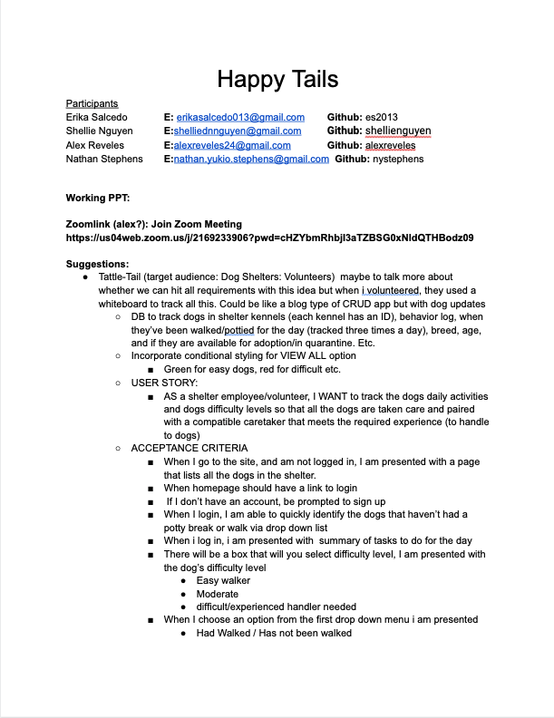
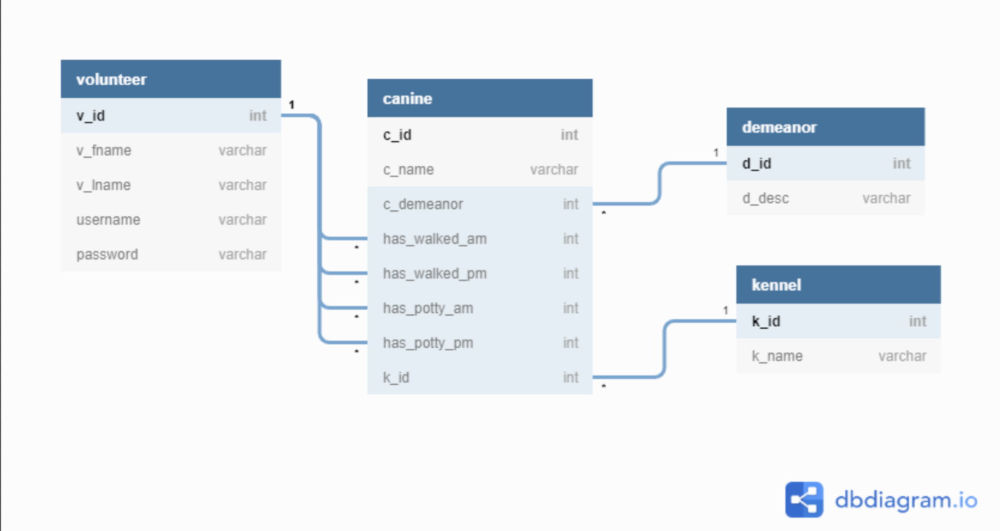
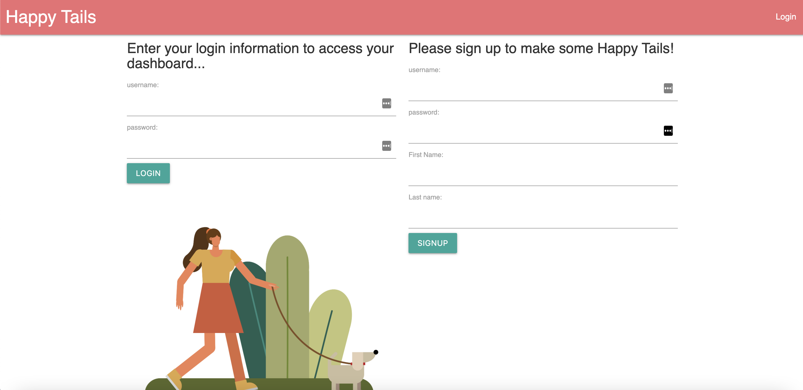
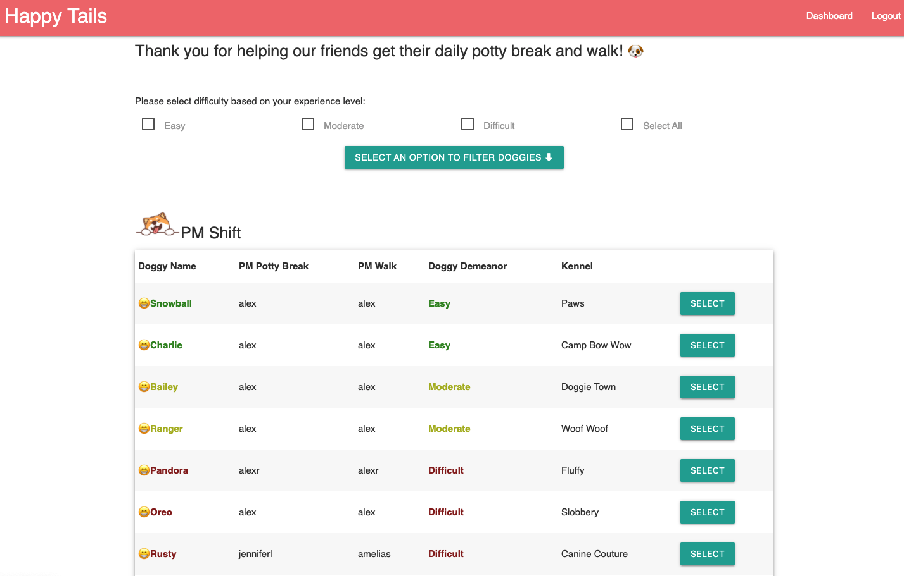
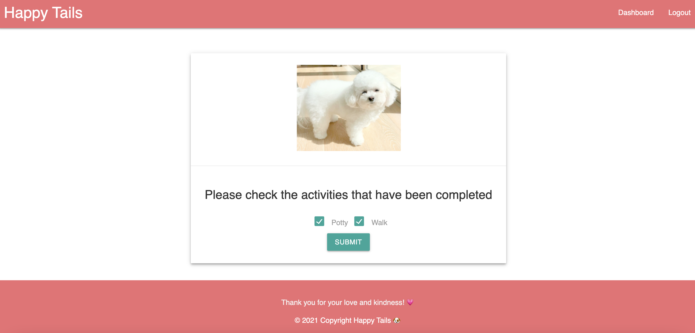

# Happy Tails
An interactive RESTful API for tracking shelter dog's daily activities.

Happy Tails Participants

Erika Salcedo 		Email: erikasalcedo013@gmail.com 	  Github: es2013

Shellie Nguyen	  Email: shelliednnguyen@gmail.com	  Github: shellienguyen

Alex Reveles		 Email: alexreveles24@gmail.com 		Github: alexreveles

Nathan Stephens 	 Email: nathan.yukio.stephens@gmail.com   Github: nystephens

Working PPT:

Zoomlink (alex?): Join Zoom Meeting
https://us04web.zoom.us/j/2169233906?pwd=cHZYbmRhbjI3aTZBSG0xNldQTHBodz09

Suggestions: 
Tattle-Tail (target audience: Dog Shelters: Volunteers) erika maybe to talk more about whether we can hit all requirements with this idea but when i volunteered, they used a whiteboard to track all this. Could be like a blog type of CRUD app but with dog updates
DB to track dogs in shelter kennels (each kennel has an ID), behavior log, when they’ve been walked/pottied for the day (tracked three times a day), breed, age, and if they are available for adoption/in quarantine. Etc.
Incorporate conditional styling for VIEW ALL option 
Green for easy dogs, red for difficult etc.

USER STORY:
AS a shelter employee/volunteer, I WANT to track the dogs daily activities and dogs difficulty levels so that all the dogs are taken care and paired with a compatible caretaker that meets the required experience (to handle to dogs).

ACCEPTANCE CRITERIA:
When I go to the site, and am not logged in, I am presented with a page that lists all the dogs in the shelter. 
When homepage should have a link to login 
 If I don’t have an account, be prompted to sign up
When I login, I am able to quickly identify the dogs that haven’t had a potty break or walk via drop down list
When i log in, i am presented with  summary of tasks to do for the day
There will be a box that will allow you to select difficulty level, I am presented with the dog’s difficulty level
Easy walker
Moderate
difficult/experienced handler needed
When I choose an option from the first drop down menu i am presented 
Had Walked / Has not been walked
Has Pottied / Has not been pottied
View all

ICEBOX:
Levels for users: 
Volunteer
Tier 1 employee (add dogs, remove dogs)
Tier 2 employee (add dogs, remove dogs, remove volunteers, add tier 1 employees)

### Happy Tails 
  
  ## Description
  AS a shelter employee/volunteer, I WANT to track the dogs daily activities and dogs difficulty levels so that all the dogs are taken care and paired with a compatible caretaker that meets the required experience (to handle to dogs).
  ##  Table of Contents
  * [Installation](#installation)
  * [Usage](#usage)
  * [License](#License)
  * [Contributing](#contributing)
  * [Tests](#Tests)
  * [Questions](#questions)
  ## Installation
  The dependencies are necessary to be installed to be able to run the application.
  ## Usage
  In order to run this application, When being in the home page you are presented with a sign up form, if you have a login username and password then you will select "Login Instead". Once the User is now logged in you are prompted with the dashboard allowing you to view and identify all dogs in the shelter that havent had a potty break or walk. As a volunteer/User this will quickly help distinguish which dogs have been paired with the Volunteer to be taken cared of and which Canine needs a Volunteer to be taken outside for their daily potty break and walk.  
  
  
  ## License
  This project is  licensed MIT license.
  
  
  
  ## Contributing
  Contributors: 
    Nathan Stephens,
    Alex Reveles,
    Erika Salcedo,
    Shellie Nguyen
  
  
  ## Github
  https://github.com/nystephens  
  https://github.com/alexreveles  
  https://github.com/es2013  
  https://github.com/shellienguyen

  
  ## Questions
  If you have any questions regarding about the application, please contact us at 
  nathan.yukio.stephens@gmail.com
  alexreveles24@gmail.com
  erikasalcedo013@gmail.com
  shelliednnguyen@gmail.com
  
  
  
  
  
  
